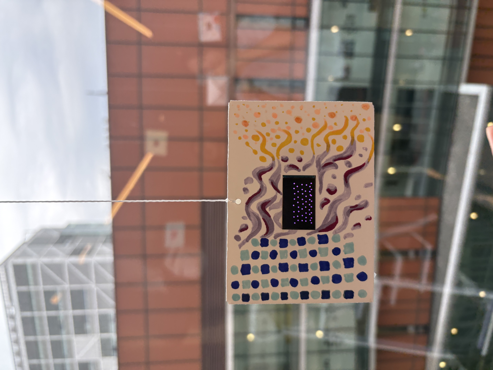

# States of Matter

A generative art installation exploring **transitions between solid, liquid, and gas** through a continuously evolving particle system on a LILYGO T-Display.

## About

The sketch visualizes particles transitioning through three states of matter:

- **Solid:** particles organize into a rigid grid and gently vibrate.
- **Liquid:** the structure loosens and particles flow toward the bottom of the display.
- **Gas:** particles move freely and disperse throughout the screen.

The transitions happen gradually, with particle movement and color changing from cool cyan to magenta to warm orange. Randomized motion makes each cycle slightly different rather than repeating a fixed animation.

## Hardware

- LILYGO / TTGO T-Display
- ESP32
- LiPo battery
- Paper envelope for installation

## Software

- Arduino IDE
- [TFT_eSPI](https://github.com/Bodmer/TFT_eSPI)

## Running the Project

1. Install ESP32 support in Arduino IDE using **esp32 by Espressif Systems**.
2. Install the **TFT_eSPI** library.
3. Connect the LILYGO T-Display to your computer.
4. In Arduino IDE, select:
   - **Board:** `ESP32 Dev Module`
   - **Port:** the serial port corresponding to your T-Display
   - **Upload Speed:** `115200`
5. Open `src/module1.ino`.
6. Upload the sketch to the board.

## Installation

The T-Display and LiPo battery were placed inside a paper envelope. The envelope extends the digital artwork into the physical installation: ordered blue geometric particles represent a **solid**, flowing cyan forms represent a **liquid**, and dispersed yellow/orange dots represent a **gas**.

